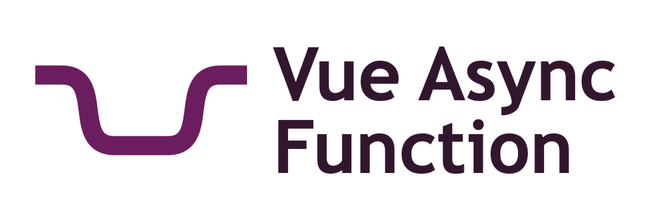

  

 

  
  
  
  
  
  

Vue Async Function delivers a compositional API for promise resolution and data fetching. It is inspired by the hooks
functions of [React Async](https://github.com/ghengeveld/react-async) and builds upon the
[Vue Composition API](https://vue-composition-api-rfc.netlify.com) that is coming with Vue 3.0.

Read more about the library in the [README](lib/README.md).
